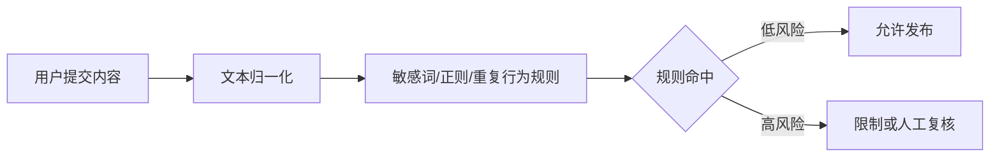
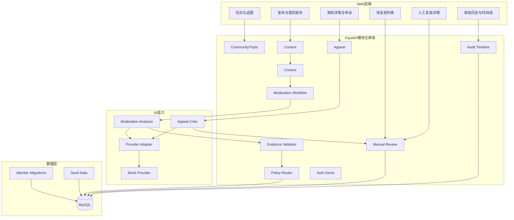
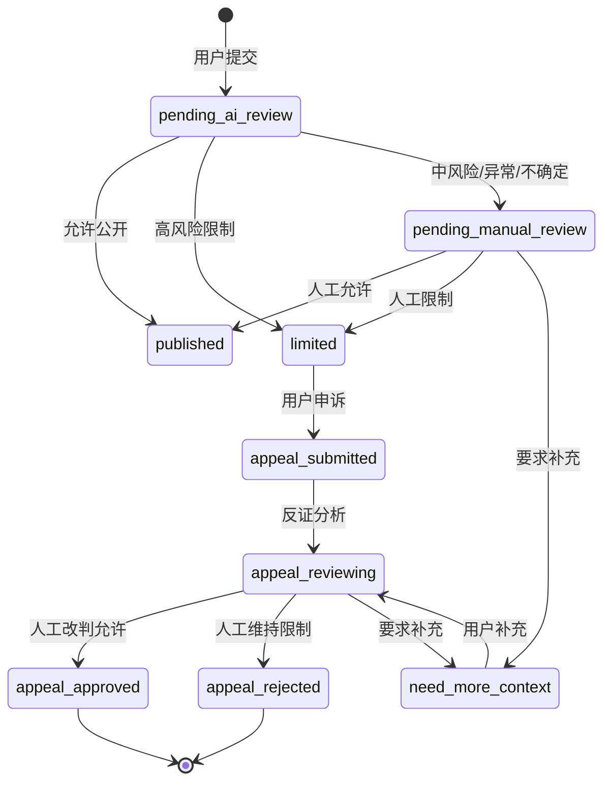
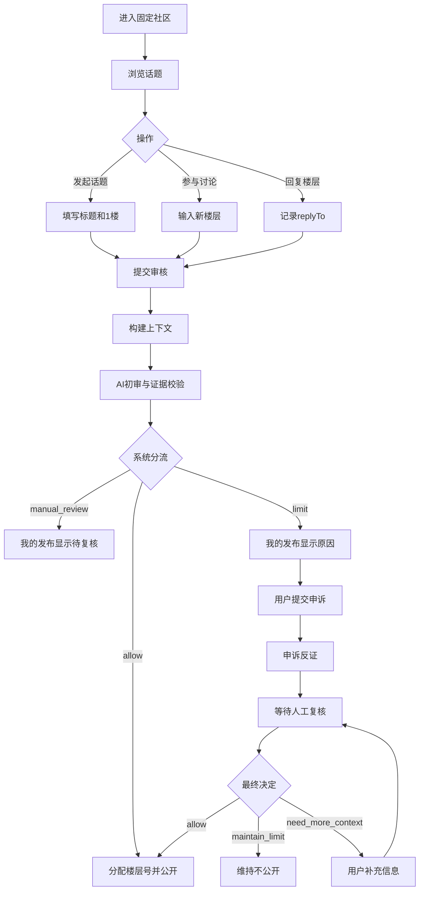
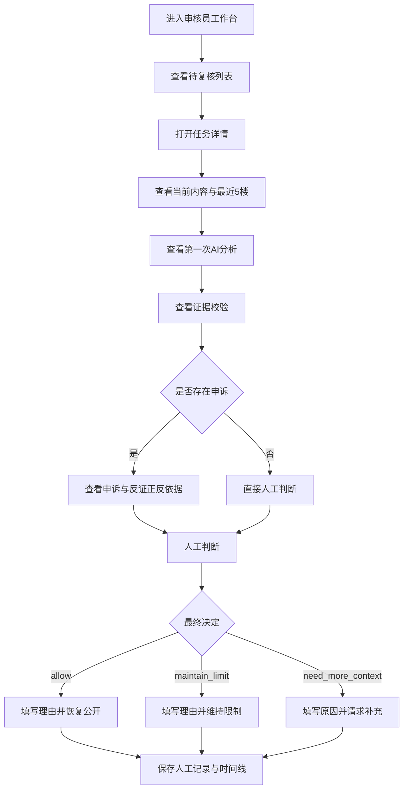
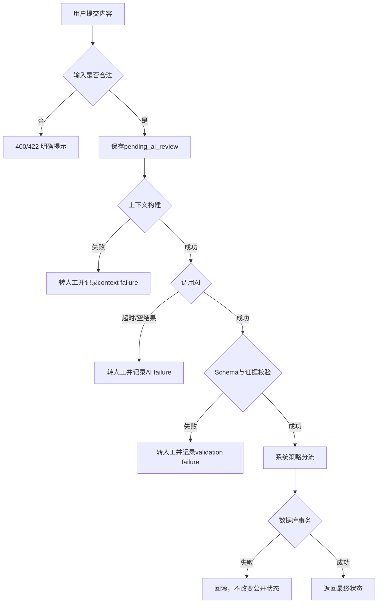

# 言鉴 AI（ContextGuard）
## AI 文字内容审核与申诉复核社区 · 方案取舍与系统设计

| 项目项 | 内容 |
| --- | --- |
| 文档类型 | Design / SDD（方案取舍与系统设计） |
| 上游输入 | `言鉴AI_ContextGuard_PRD_v1.0.md` |
| 参考格式 | `design-options(2).md` |
| 产品形态 | 单社区、多话题、线性楼层式文字讨论社区 |
| 团队规模 | 2 人 |
| 项目周期 | Day 5–Day 6 开发，Day 7 答辩 |
| 文档版本 | v1.1 |
| 文档状态 | 设计方案已收敛，待进入任务拆解与研发 |
| 最后更新 | 2026-07-16 |

> **文档定位**：本文依据 PRD，在正式功能开发前完成方案比较、架构取舍、数据契约、AI 边界、失败兜底和研发接棒设计。本文只描述“计划如何实现”，不记录任何页面、接口或功能的实际完成状态；开发进度应单独记录在 `tasks.md`、`dev-log.md` 和测试记录中。

> **设计目标**：在“两天内可交付、可运行、可演示、可追溯”的约束下，为 PRD 中的 P0 能力提供可直接研发和测试的设计基线，同时为 P1/P2 保留清晰扩展边界。

---

## 1. 设计背景

言鉴 AI 面向文字社区的内容发布与审核场景，核心业务是：

1. 用户在固定社区中发起话题或发布新楼层；
2. 系统加载当前内容、回复对象、最近楼层和相关历史；
3. AI 判断说话者、目标对象、表达意图和风险；
4. 系统校验 AI 输出结构和证据真实性；
5. 系统将内容路由为允许、限制或人工复核；
6. 用户查看具体原因，并可对受限内容发起申诉；
7. 申诉 AI 从反证视角检查第一次判断；
8. 审核员维持或改判，并填写具体理由；
9. 系统决定内容是否进入公开楼层；
10. 所有关键节点写入时间线和审计记录。

本设计必须同时满足：

- 两天内形成可运行闭环；
- 前端、后端、数据库和 AI 模块可以并行开发并通过契约联调；
- P0 先完成主流程，P1/P2 不得反向挤占核心闭环；
- AI 是核心判断能力，而不是装饰性功能；
- AI 不能直接承担最终申诉裁决；
- 模型失败不得导致高风险内容自动公开；
- AI 建议、系统分流和人工决定必须分层保存；
- 主路径、边界路径和失败路径均可验证；
- 两名成员都能独立说明自己的核心设计与证据；
- 设计不能为了“技术先进”而牺牲交付确定性。

---


## 2. 设计输入与假设

### 2.1 上游输入

本设计只以上游 PRD 为业务依据，重点承接以下 P0 要求：

- 一个固定社区和多个话题；
- 用户发起话题、发布楼层和回复指定楼层；
- 每一楼公开前进行上下文审核；
- 审核结果支持允许、限制和人工复核；
- 用户可以查看自己的审核结果并发起申诉；
- 申诉阶段需要独立反证分析；
- 审核员拥有最终裁决权；
- 审核、申诉和改判全过程可追溯。

### 2.2 设计假设

1. 项目周期只有两天，优先保证 P0 闭环；
2. 产品只处理纯文字，不处理图片、视频和语音；
3. MVP 采用一个固定社区，不实现社区创建和加入流程；
4. 普通用户和审核员使用同一个 Web 应用；
5. P0 使用预置身份或请求头模拟身份，不实现完整登录注册；
6. 每名成员在本机运行独立 MySQL，通过迁移脚本和 Seed 数据保持一致；
7. 大模型可能超时、返回非法结构或生成无效证据；
8. AI 不直接承担申诉最终裁决；
9. 审核通过后才分配公开楼层号；
10. 实施阶段如需变更本设计，必须记录变更原因及对 PRD/TDD 的影响。

### 2.3 设计产出

本文需要向下游研发提供：

- 最终方案及不选方案理由；
- 总体架构和模块边界；
- 页面职责与交互主路径；
- 数据模型和状态机；
- AI 输入、输出与证据校验契约；
- API 摘要；
- 关键事务、失败兜底、权限与审计设计；
- P0/P1/P2 边界；
- PRD 到模块的追踪关系；
- 两人研发责任与接棒检查项。


## 3. 设计约束

| 约束 ID | 约束 | 对设计的影响 |
| --- | --- | --- |
| C-01 | 两天内完成可运行 Demo | 采用模块化单体，避免微服务和复杂基础设施 |
| C-02 | 前后端需要并行开发 | 先冻结页面职责、状态枚举和 API Schema，双方按契约实现 |
| C-03 | 两人并行开发 | 先冻结 Schema、状态、API 和迁移规则 |
| C-04 | 两人各自使用本地 MySQL | 使用 Alembic 迁移与 Seed 保持结构和基础数据一致 |
| C-05 | AI 是核心能力 | P0 必须跑真实或可替换 AI Provider，不仅展示固定 Mock |
| C-06 | AI 结果不稳定 | 所有输出必须 Schema 校验、证据校验和失败降级 |
| C-07 | 需要上下文判断 | 必须加载被回复楼层、最近楼层和相关历史 |
| C-08 | 用户有申诉权 | 申诉不能只重复第一次模型调用，必须有人工作为最终裁决 |
| C-09 | 内容发布前审核 | 未通过或待复核内容不得进入公开楼层 |
| C-10 | 楼层号不能缺号 | 仅在最终公开事务中分配楼层号 |
| C-11 | P0 不做完整登录 | 使用 `X-User-Id` 模拟身份，但后端仍校验权限 |
| C-12 | 需要答辩展示 | 必须展示 AI 理由、证据、系统分流、人工改判和时间线 |
| C-13 | 数据中可能含攻击性文字 | 普通用户不能看到他人受限内容和内部审核策略 |
| C-14 | 网络和模型可能不稳定 | AI 超时、空结果和非法 JSON 统一转人工 |
| C-15 | 项目规模较小 | 不引入 Kafka、RabbitMQ、Redis、向量库和独立工作流服务 |

---

## 4. 设计决策原则

本次设计采用以下判断顺序：

1. **先保证 P0 审核与申诉闭环完整**；
2. **再保证两天内能运行和演示**；
3. **AI 负责语义判断，代码负责确定性校验和状态流转**；
4. **AI 建议、系统决定与人工结果分层保存**；
5. **每一个高风险结论都必须绑定可验证证据**；
6. **不确定性不是错误，应该成为转人工的信号**；
7. **异常必须可见、可恢复、可追溯**；
8. **申诉阶段必须主动寻找原判漏洞**；
9. **P1/P2 通过模块扩展，不反向污染 P0**；
10. **不为“AI Native”盲目增加自主 Agent、RAG 或多模型投票**；
11. **不为“像社区”增加点赞、收藏、私信和嵌套评论**；
12. **前后端字段和状态一旦冻结，非必要不再变化**。

---

## 5. AI 发散得到的 5 个原始方案

| 原始方案 | 核心形态 | 主要特点 | 初步判断 |
| --- | --- | --- | --- |
| S1 | 敏感词与正则规则审核 | 实现快、确定性强 | 无法可靠识别引用、反讽和隐晦骚扰 |
| S2 | 单次大模型直接裁决 | 将当前内容和上下文一次发给模型 | 语义能力强，但证据和稳定性不足 |
| S3 | 规则 + AI 上下文分析 | 规则提取信号，模型做语义判断 | 可解释性较好，但仍需明确人机边界 |
| S4 | 受控 AI 工作流 + 证据校验 + 人工复核 | 固定编排两个 AI 角色和人工节点 | 覆盖题目完整，风险和复杂度可控 |
| S5 | 多 Agent 自主审核委员会 | 多个 Agent 讨论、投票并自主调用工具 | 展示感强，但两天内不可控且难复现 |

### 5.1 合并原则

- S1 保留为 **方案 A：规则主导审核**；
- S2 保留为 **方案 B：单模型直接审核**；
- S3 与 S4 合并为 **方案 C：受控 AI 工作流 + 证据校验 + 人工复核**；
- S5 作为方案 C 的过度复杂变体，不进入最终主方案。

三个候选方案在“判断权归属、证据能力和失败边界”上本质不同，而不是界面换皮。

---

## 6. 三个本质不同方案总览

| 方案 | 判断核心 | 核心优势 | 核心风险 | 兜底方式 | 结论 |
| --- | --- | --- | --- | --- | --- |
| A | 敏感词、正则和固定阈值 | 快、便宜、可复现 | 引用误杀、隐晦攻击漏判 | 高风险词转人工 | 仅作为辅助规则 |
| B | 单个大模型一次性输出结果 | 语义能力强、接入快 | 幻觉证据、输出不稳定、申诉重复错误 | JSON 校验、失败转人工 | 不作为最终架构 |
| C | AI 上下文分析 + 代码校验 + 人工裁决 | 覆盖完整、可解释、可申诉、可追溯 | 模块和状态较多 | 固定工作流、Mock Provider、事务与审计 | **选中** |

---

## 7. 方案 A：规则主导审核

### 7.1 架构示意



### 7.2 优势

- 两天内最容易实现；
- 输出稳定、可测试、可复现；
- 对明确威胁、诈骗链接、隐私格式等确定性线索有效；
- 不依赖模型网络和 API；
- 适合作为 AI 输入信号和兜底能力。

### 7.3 风险

- 容易误杀引用、举报和反驳内容；
- 无法准确理解说话者、目标对象和意图；
- 对外号、暗示、反讽和连续骚扰能力弱；
- 难以生成有业务价值的上下文理由；
- 无法体现本题 AI Native 的核心价值。

### 7.4 失败路径与兜底

| 失败点 | 表现 | 兜底 |
| --- | --- | --- |
| 安全引用命中敏感词 | 正常内容被限制 | 引用标记命中后转 AI 或人工 |
| 隐晦攻击无关键词 | 高风险内容被放行 | 使用行为规则与 AI 语义判断 |
| 新型表达未进入词表 | 规则失效 | 记录案例并进入回归集 |

### 7.5 不选为主方案的原因

规则适合处理确定性事实，但无法解决题目最关键的“上下文中的行为判断”。因此规则只能作为信号、验证与安全兜底，不能成为最终审核核心。

---

## 8. 方案 B：单模型直接审核

### 8.1 架构示意


### 8.2 优势

- 接入速度快；
- 能理解引用、反讽和隐晦表达；
- Prompt 可直接约束输出字段；
- 演示时容易展示 AI 语义能力。

### 8.3 风险

- 可能返回非法 JSON；
- 可能编造不存在的证据；
- 置信度并不等于真实正确率；
- 相同输入可能得到不同结果；
- 模型容易忽略指定上下文；
- 申诉再次调用同一模型可能重复第一次错误；
- 若模型直接决定限制，会让责任边界不清晰。

### 8.4 失败路径与兜底

| 失败点 | 表现 | 兜底 |
| --- | --- | --- |
| 模型超时 | 发布请求长期等待 | 超时后转人工 |
| 非法 JSON | 后端无法解析 | Schema 校验失败转人工 |
| 证据不存在 | 解释看似合理但不可验证 | 证据定位校验失败转人工 |
| 结果不稳定 | 同案例前后不同 | 固定 Prompt 版本与回归集 |
| 申诉重复错误 | 第二次结论仍与第一次相同 | 使用独立反证角色和人工终审 |

### 8.5 不选为最终方案的原因

单模型方案虽然交付快，但无法独立提供可信证据、失败控制和申诉纠错。它可以作为受控工作流中的语义分析节点，但不能直接承担完整业务决策。

---

## 9. 方案 C：受控 AI 工作流 + 证据校验 + 人工复核

### 9.1 总体架构



### 9.2 核心优势

- AI 真正承担上下文语义分析；
- 代码负责结构、证据和权限的确定性校验；
- 申诉使用独立反证角色，不只是重复第一次判断；
- 人工保留最终决定权；
- AI 建议、系统分流、人工决定分层保存；
- 失败路径清楚，不会因为 AI 异常直接放行；
- 能完整支撑用户端、审核端和答辩展示；
- 前端、后端、AI 与数据层可以按模块独立实现并通过契约集成；
- 后续可替换模型 Provider，而不改业务接口。

### 9.3 主要风险

- 模块、状态和数据表数量较多；
- 前后端字段不一致会造成联调问题；
- AI 证据校验需要额外代码；
- 楼层号分配存在并发风险；
- 申诉和人工复核事务较长；
- P1 功能容易挤占 P0 时间。

### 9.4 兜底

| 风险 | 兜底方案 |
| --- | --- |
| 真实模型未接通 | 使用相同 Schema 的 Mock Provider 演示固定失败路径 |
| AI 超时或格式错误 | 统一转 `pending_manual_review` |
| 证据无法验证 | 标记 `evidence_valid=false` 并转人工 |
| 前后端字段变化 | 以 Design 中的 API 契约和 Pydantic Schema 为唯一基准 |
| 申诉反证未完成 | 允许审核员基于原审核与补充上下文人工复核 |
| 审核队列表未完成 | 从 contents + appeals 动态生成 |
| 楼层号并发 | 数据库事务 + 唯一约束 + 重试 |
| 时间不足 | 冻结 P1，优先三条端到端演示链 |

### 9.5 结论

方案 C 在 AI Native 核心价值、可信性、申诉纠错、两天交付和答辩展示之间达到最佳平衡，因此作为最终方案。

---

## 10. 五维评分与方案选择

### 10.1 评分维度

| 维度 | 权重 | 判断标准 |
| --- | ---: | --- |
| 核心问题覆盖 | 25% | 是否解决引用误判、隐晦骚扰和申诉纠错 |
| 两天交付可行性 | 20% | 是否能快速形成闭环 |
| AI 可信性 | 20% | 是否有结构化输出、证据验证和降级 |
| 答辩展示效果 | 20% | 是否容易展示 AI 判断和人工纠错 |
| 扩展与维护 | 15% | 是否支持替换模型和渐进增加能力 |

### 10.2 方案评分

评分范围 1～5，越高越有利。

| 方案 | 核心覆盖 | 交付可行 | AI 可信 | 展示效果 | 扩展维护 | 加权总分 |
| --- | ---: | ---: | ---: | ---: | ---: | ---: |
| A 规则主导 | 2 | 5 | 4 | 2 | 3 | **3.15** |
| B 单模型直接审核 | 4 | 4 | 2 | 4 | 3 | **3.50** |
| C 受控 AI 工作流 | 5 | 4 | 5 | 5 | 4 | **4.65** |

### 10.3 人工结论

C 不是代码最少的方案，但它是唯一能够同时证明以下内容的方案：

- AI 使用了上下文；
- AI 结论有真实证据；
- 系统不会盲信 AI；
- AI 错误可以通过申诉被发现；
- 人工可以纠正 AI；
- 原判和改判都能追溯。

---

## 11. 最终方案选择

### 11.1 最终选择

> **选择方案 C：React Web 前端 + FastAPI 模块化单体 + MySQL + 受控 AI 审核工作流 + 人工复核。**

### 11.2 选择理由

1. 完整承接 PRD 的社区、审核、申诉和复核闭环；
2. 单 Web 应用能够同时覆盖普通用户端与审核员端，并降低双端重复开发成本；
3. 模块化单体能够用清晰模块承接社区、审核、申诉、复核与审计能力；
4. AI 负责上下文语义，代码负责证据和状态，责任清晰；
5. 两个 AI 角色已经足够，不需要复杂多 Agent；
6. AI 异常有统一转人工路径；
7. MySQL 可以保存审核、申诉、人工结果和审计时间线；
8. 两人可以按初审链和申诉链并行开发；
9. 最终可以稳定演示正向、反向和申诉改判三条路径；
10. 后续可增加真实登录、规则配置和统计，而无需推翻主结构。

### 11.3 为什么不选纯规则

- 无法解决题目强调的上下文语义；
- 无法可靠区分引用批评与本人攻击；
- 无法识别没有敏感词的连续骚扰；
- 答辩时难以证明 AI Native 核心能力。

### 11.4 为什么不选单模型自动裁决

- 模型输出可能无效或编造证据；
- 无法保证相同输入结果稳定；
- 申诉容易重复同一错误；
- 模型直接限制内容会模糊责任边界；
- 缺少确定性系统校验和人工最终裁决。

### 11.5 为什么不选多 Agent 自主委员会

- 本项目流程本身是固定业务流程，不需要模型自主规划；
- 多 Agent 会增加调用次数、延迟和不确定性；
- 多数投票不等于事实正确；
- 两天内难以完成可重复测试和失败定位；
- 会削弱证据校验和人工责任边界。

---

## 12. Web 产品形态取舍

### 12.1 一个前端还是两个前端项目

**选择：一个 React Web 应用，通过角色入口和路由区分普通用户端与审核员端。**

理由：

- 减少重复工程和公共组件；
- 用户端与审核端共享状态标签、证据卡片和时间线；
- 模拟身份切换适合比赛演示；
- 一个应用即可通过路由、角色入口和权限校验区分两类用户；
- 后续可通过真实登录和路由守卫增强权限。

### 12.2 单社区还是多社区

**选择：一个固定社区，多个话题。**

原因：

- 多社区、加入申请和成员管理不属于本题核心；
- 一个社区已足以展示上下文和不同用户互动；
- 可以减少权限、成员关系和管理页面；
- 将开发时间集中在 AI 审核与申诉闭环。

### 12.3 嵌套评论还是线性楼层

**选择：线性楼层，可回复指定楼层，但不产生嵌套评论。**

原因：

- 保留回复对象和上下文；
- 页面和数据模型简单；
- AI 可以加载最近楼层和被回复楼层；
- 不需要树形查询、折叠和无限层级；
- 符合论坛楼层式讨论习惯。

---

## 13. 前端架构设计

### 13.1 页面模块

| 页面/模块 | 职责 | 优先级 |
| --- | --- | --- |
| CommunityPage | 固定社区信息、话题列表、搜索分类 | P0 |
| TopicDetailPage | 公开楼层、回复、发布新楼层 | P0 |
| MyPostsPage | 用户自己的全部发布和审核状态 | P0 |
| AppealsPage | 用户申诉列表、状态和结果 | P0 |
| ReviewerDashboard | 待复核任务列表 | P0 |
| ReviewDetailPage | 上下文、AI 结果、申诉和人工决定 | P0 |
| ReviewHistoryPage | 已处理任务和结果回看 | P1 |
| AppShell | 布局、身份切换、角色入口 | P0 |

### 13.2 前端数据层取舍

前端数据层采用以下调用链：

```text
页面组件
→ api/*.ts
→ HTTP API
→ FastAPI
```

原则：

- 页面不直接拼接后端 URL；
- 请求与响应类型集中定义；
- 可提供 Mock Adapter 用于并行开发，但 Mock 数据与真实 API 状态必须通过统一接口隔离；
- 真实 API 接通后通过 Provider 或环境变量切换；
- 状态和枚举由共享常量统一管理；
- 用户端不得显示 `reviewerReason`、`rawResult` 和内部策略。

### 13.3 前端状态展示原则

- 状态必须使用文字，不能只依赖颜色；
- AI 建议和系统决定分开展示；
- 人工改判时展示“原判 → 最终决定”；
- 审核中、限制中和申诉中的内容不显示公开楼层号；
- 失败时显示明确原因和下一步；
- 时间线按事件顺序展示，不覆盖历史记录。

---

## 14. 服务端架构取舍

### 14.1 模块化单体 vs 微服务

**选择：FastAPI 模块化单体。**

| 对比项 | 模块化单体 | 微服务 |
| --- | --- | --- |
| 两天交付 | 高 | 低 |
| 本地启动 | 一个服务 | 多个服务 |
| 数据事务 | 容易保证 | 需要分布式协调 |
| 调试和日志 | 集中 | 分散 |
| 当前规模 | 足够 | 过度设计 |
| 后续扩展 | 可按模块拆分 | 当前成本过高 |

### 14.2 推荐代码结构

```text
backend/
├── app/
│   ├── api/
│   │   ├── auth.py
│   │   ├── community.py
│   │   ├── topics.py
│   │   ├── contents.py
│   │   ├── appeals.py
│   │   └── reviewer.py
│   ├── core/
│   │   ├── config.py
│   │   ├── database.py
│   │   ├── enums.py
│   │   └── errors.py
│   ├── models/
│   ├── schemas/
│   ├── repositories/
│   ├── services/
│   │   ├── community_service.py
│   │   ├── topic_service.py
│   │   ├── content_service.py
│   │   ├── context_service.py
│   │   ├── moderation_service.py
│   │   ├── evidence_service.py
│   │   ├── policy_service.py
│   │   ├── appeal_service.py
│   │   ├── review_service.py
│   │   └── audit_service.py
│   ├── ai/
│   │   ├── providers/
│   │   ├── prompts/
│   │   ├── moderation_analyzer.py
│   │   └── appeal_critic.py
│   └── main.py
├── alembic/
├── scripts/
│   └── seed.py
├── tests/
├── .env.example
└── requirements.txt
```

### 14.3 模块边界

| 模块 | 主要职责 | 不负责 |
| --- | --- | --- |
| CommunityService | 固定社区读取 | 不管理多社区加入关系 |
| TopicService | 话题创建、查询、公开状态 | 不判断内容风险 |
| ContentService | 内容提交、状态和楼层号 | 不直接调用模型 |
| ContextService | 被回复楼层、最近楼层、相关历史 | 不作最终处罚 |
| ModerationService | 编排初审流程 | 不直接相信模型原始输出 |
| EvidenceService | 校验证据 contentId 与原文 | 不生成风险结论 |
| PolicyService | 根据验证结果路由状态 | 不生成 AI 理由 |
| AppealService | 申诉提交、反证分析和状态 | 不代替审核员终审 |
| ReviewService | 人工决定与恢复公开 | 不修改原始 AI 记录 |
| AuditService | 保存事件时间线 | 不参与风险判断 |
| ProviderAdapter | 屏蔽模型厂商差异 | 不承载业务状态 |

---

## 15. AI、规则与人工的取舍

### 15.1 三层职责

| 层次 | 负责内容 | 不负责 |
| --- | --- | --- |
| 确定性代码/规则 | 输入校验、上下文加载、证据定位、权限、状态事务 | 不单独理解复杂语义 |
| AI | 说话者、对象、意图、风险、上下文关系和不确定点 | 不直接作申诉最终裁决 |
| 人工审核员 | 争议内容和申诉的最终决定 | 不覆盖或删除原始 AI 记录 |

### 15.2 初审 AI：Moderation Analyzer

负责：

- 识别当前作者和目标用户；
- 判断引用、转述、举报、反驳或赞同攻击；
- 识别辱骂、威胁、诈骗、歧视和骚扰；
- 分析连续针对和群体施压；
- 输出证据、上下文依据和不确定点；
- 给出建议动作。

### 15.3 申诉 AI：Appeal Critic

负责：

- 读取第一次 AI 判断和证据；
- 对比原始上下文与补充上下文；
- 主动寻找第一次判断的漏洞；
- 同时输出支持维持与支持改判的依据；
- 说明新证据是否足以改变判断；
- 将仍不确定的问题交给审核员。

### 15.4 人工最终责任

审核员负责：

- 允许公开；
- 维持限制；
- 要求补充上下文；
- 填写具体理由；
- 对最终决定负责。

人工结果不得物理覆盖原始系统结果，而应作为独立记录保存。

---

## 16. RAG、Agent 与模型调用取舍

### 16.1 是否使用 RAG

**本期不使用 RAG。**

原因：

- 本项目知识范围不是大规模文档库；
- AI 需要的主要输入是话题上下文、回复关系和固定审核策略；
- 最近 5 楼、回复对象和相关历史可以直接查询；
- 向量切分、召回和评测会增加两天开发成本；
- 错误召回会进一步影响审核判断。

后续需要加载大量社区规则、历史案例和多套治理政策时，再考虑 RAG。

### 16.2 是否使用自主 Agent

**本期不使用自主规划 Agent。**

原因：

- 审核流程步骤固定；
- 不需要模型自主决定调用什么高权限工具；
- 自主 Agent 可能重复调用、增加成本和延迟；
- 固定工作流更容易测试、回放和答辩；
- 人工最终拍板，不需要模型自主执行处罚。

### 16.3 本期采用的 AI Native 方式

```text
系统构建上下文
→ Moderation Analyzer 语义分析
→ Schema 校验
→ Evidence Validator 证据验证
→ Policy Router 系统分流
→ 低风险公开 / 中风险人工 / 高风险限制
→ 用户申诉时调用 Appeal Critic
→ 审核员最终裁决
```

AI 是核心判断节点，但被确定性代码和人工边界约束。

---

## 17. 同步、异步与离线取舍

### 17.1 可选方式

| 方式 | 优势 | 风险 |
| --- | --- | --- |
| 全同步 | 实现最简单，前端可直接展示结果 | 模型慢时请求等待 |
| 全异步 + 消息队列 | 稳定、可扩展 | 两天内基础设施过重 |
| 轻量状态化同步 | 请求内调用 AI，超时转人工并持久化状态 | 需要清晰超时和事务边界 |

### 17.2 最终选择

**P0 采用轻量状态化同步，不引入消息队列。**

流程：

1. 用户提交内容；
2. 后端先保存 `pending_ai_review`；
3. 请求内构建上下文并调用 AI；
4. 在限定超时时间内返回审核结果；
5. 超时或失败时返回 `pending_manual_review`；
6. 所有状态已保存，前端可重新查询；
7. P1 再考虑后台任务或进程内任务。

P0 不引入 Redis、Celery、RabbitMQ、Kafka。

---

## 18. 数据与存储设计

### 18.1 数据库选择

**选择 MySQL 保存全部结构化业务数据。**

理由：

- 当前数据关系明确；
- 需要事务保证人工改判和楼层号分配；
- 需要唯一约束与索引；
- 两人本地开发可通过迁移保持一致；
- 适合审核、申诉和审计历史查询。

### 18.2 本地协作方式

```text
成员 A 本地 MySQL
成员 B 本地 MySQL
        ↑
Git 同步 Alembic 迁移 + seed.py
```

禁止：

- 只在 Navicat 手工改表但不生成迁移；
- 提交 `.env` 和数据库密码；
- 两人同时从同一旧迁移生成互相分叉的 Head。

### 18.3 核心数据表

```text
users
scenes
topics
contents
moderation_records
appeals
manual_reviews
audit_logs
```

P0 不单独建立 `review_tasks`，审核队列从内容与申诉状态动态生成。

---

## 19. 核心数据模型

### 19.1 users

| 字段 | 类型 | 说明 |
| --- | --- | --- |
| id | varchar(36) PK | 用户 ID |
| username | varchar(80) | 用户名 |
| display_name | varchar(80) | 展示名称 |
| role | varchar(20) | user / reviewer |
| created_at | datetime | 创建时间 |

### 19.2 scenes

MVP 继续使用 `scenes` 表表示固定社区，不强制重命名。

| 字段 | 类型 | 说明 |
| --- | --- | --- |
| id | varchar(36) PK | 社区 ID |
| type | varchar(30) | community |
| title | varchar(120) | 社区名称 |
| description | text | 社区简介 |
| created_at | datetime | 创建时间 |

### 19.3 topics

| 字段 | 类型 | 约束 | 说明 |
| --- | --- | --- | --- |
| id | varchar(36) | PK | 话题 ID |
| scene_id | varchar(36) | FK/index | 所属社区 |
| author_id | varchar(36) | FK/index | 发起人 |
| title | varchar(120) | not null | 标题 |
| summary | varchar(255) | not null | 摘要 |
| category | varchar(40) | index | 分类 |
| status | varchar(30) | index | 状态 |
| visible_to_public | boolean | not null | 是否公开 |
| view_count | integer | default 0 | 浏览量 |
| last_active_at | datetime | index | 最近公开时间 |
| created_at | datetime | not null | 创建时间 |
| updated_at | datetime | not null | 更新时间 |

业务规则：

- 发起话题同时创建 Topic 和 1 楼 Content；
- 1 楼审核通过后，话题才公开；
- 1 楼限制或待复核时，仅作者和审核员可见；
- 1 楼申诉成功后，话题恢复公开。

### 19.4 contents

| 字段 | 类型 | 说明 |
| --- | --- | --- |
| id | varchar(36) PK | 内容 ID |
| scene_id | varchar(36) FK | 固定社区 |
| topic_id | varchar(36) FK/index | 所属话题 |
| author_id | varchar(36) FK/index | 作者 |
| parent_id | varchar(36) nullable | 被回复内容 |
| target_user_id | varchar(36) nullable | 明确目标用户 |
| content_type | varchar(30) | topic_root / forum_reply |
| text | text | 原文 |
| normalized_text | text | 归一化文本 |
| status | varchar(40) index | 当前状态 |
| floor_number | integer nullable | 公开楼层号 |
| visible_to_public | boolean | 是否公开 |
| created_at | datetime | 创建时间 |
| updated_at | datetime | 更新时间 |

约束：

```text
UNIQUE(topic_id, floor_number)
```

### 19.5 moderation_records

| 字段 | 说明 |
| --- | --- |
| content_id | 对应内容 |
| provider | 模型提供方 |
| prompt_version | Prompt 版本 |
| model_version | 模型版本 |
| rule_version | 规则版本 |
| risk_level | 0–3 |
| risk_score | 0–100，可选展示 |
| risk_types | JSON |
| context_tags | JSON |
| intent | 表达意图 |
| target_user_ids | JSON |
| evidence | JSON |
| context_used | JSON |
| uncertainties | JSON |
| confidence | 置信度 |
| suggested_action | AI 建议 |
| system_decision | 系统分流 |
| evidence_valid | 证据是否通过 |
| user_visible_reason | 用户可见理由 |
| reviewer_reason | 审核员理由 |
| raw_ai_response | 原始模型结果 |
| failure_reason | 失败原因 |
| created_at | 创建时间 |

### 19.6 appeals

| 字段 | 说明 |
| --- | --- |
| content_id | 被申诉内容 |
| user_id | 申诉人 |
| appeal_type | 申诉类型 |
| reason | 申诉理由 |
| extra_context | 补充上下文 |
| counter_analysis | 申诉反证 AI 输出 |
| status | submitted / reviewing / approved / rejected |
| analyzed_at | 反证完成时间 |
| created_at | 创建时间 |
| updated_at | 更新时间 |

### 19.7 manual_reviews

| 字段 | 说明 |
| --- | --- |
| content_id | 内容 |
| appeal_id | 申诉，可为空 |
| reviewer_id | 审核员 |
| original_decision | 原系统决定 |
| final_decision | allow / maintain_limit / need_more_context |
| review_reason | 人工理由 |
| correction_type | false_positive / false_negative / correct / policy_unclear |
| created_at | 复核时间 |

### 19.8 audit_logs

建议事件：

```text
content.submitted
moderation.context_built
moderation.completed
moderation.failed
evidence.validated
content.published
content.limited
content.manual_review_requested
appeal.submitted
appeal.counter_analyzed
manual_review.decided
content.restored
context.requested
```

---

## 20. 状态机设计

### 20.1 内容状态机



### 20.2 状态与公开性

| 状态 | 是否公开 |
| --- | ---: |
| pending_ai_review | 否 |
| published | 是 |
| limited | 否 |
| pending_manual_review | 否 |
| need_more_context | 否 |
| appeal_submitted | 否 |
| appeal_reviewing | 否 |
| appeal_approved | 是 |
| appeal_rejected | 否 |

### 20.3 楼层号分配

审核中、限制中和人工复核中均不分配楼层号。

公开事务：

```text
锁定话题或楼层号范围
→ 查询 MAX(floor_number)
→ 分配 +1
→ 更新内容状态和 visible_to_public
→ 更新话题 last_active_at
→ 写入 audit_logs
→ 提交事务
```

若唯一约束冲突，重新读取并重试一次。

---

## 21. AI 上下文构建设计

### 21.1 最小上下文包

AI 输入至少包括：

```text
固定社区
当前话题标题
当前待审核内容
当前作者
被回复楼层
被回复用户
当前内容之前最近 5 个公开楼层
当前作者近期相关发言
目标用户近期相关发言
```

### 21.2 查询规则

- 最近上下文必须限定在当前 `topic_id`；
- `parent_id` 指向的内容必须单独加载；
- 只加载公开内容和当前作者自己的待审核内容；
- 连续骚扰检查同一作者是否多次指向同一对象；
- 对象已经明确要求停止是重要信号；
- 必须区分“引用并批评”和“引用后赞同攻击”；
- 不把整个社区和全部历史一次性发送给模型；
- 原文和归一化文本同时保留，证据必须引用原文。

### 21.3 上下文窗口取舍

| 方案 | 优势 | 风险 | 结论 |
| --- | --- | --- | --- |
| 只看当前内容 | 便宜 | 容易误判 | 不采用 |
| 整个话题全部内容 | 信息完整 | 噪声、长度和成本高 | 不采用 |
| 回复对象 + 最近 5 楼 + 相关历史 | 相关性和成本平衡 | 可能遗漏远期信息 | **采用** |

审核员页面可以展示更多历史，但 P0 模型输入保持受控。

---

## 22. AI 输出与证据验证设计

### 22.1 初审输出契约

```json
{
  "riskLevel": 2,
  "riskScore": 76,
  "riskTypes": ["harassment", "implicit_attack"],
  "contextTags": ["repeated_targeting", "group_pressure"],
  "speakerId": "student_b",
  "targetUserIds": ["student_a"],
  "intent": "持续针对特定用户并引导群体围观",
  "evidence": [
    {
      "contentId": "content-005",
      "quote": "大家都看看他平时是什么样",
      "reason": "结合前文存在群体施压倾向"
    }
  ],
  "contextUsed": ["当前内容", "被回复楼层", "最近5楼"],
  "uncertainties": ["无法确认双方线下关系"],
  "confidence": 0.84,
  "suggestedAction": "manual_review",
  "userVisibleReason": "内容可能涉及持续针对他人的表达，已进入人工复核。",
  "reviewerReason": "建议检查发布者是否持续针对同一用户。"
}
```

### 22.2 固定验证流水线

```text
Pydantic Schema 校验
→ 枚举校验
→ 必填字段校验
→ evidence.contentId 是否属于输入上下文
→ quote 是否真实存在于对应原文
→ targetUserIds 是否可解析
→ suggestedAction 是否合法
→ Policy Router 系统分流
→ 写入 moderation_records
→ 写入 audit_logs
```

### 22.3 统一转人工条件

- AI 超时；
- AI 返回空内容；
- 非法 JSON；
- 必填字段缺失；
- 使用未定义枚举；
- 证据引用不存在的内容；
- quote 无法在原文定位；
- AI 与确定性规则明显冲突；
- 上下文构建失败；
- 上下文不足；
- 双模型结果分歧（P1）。

### 22.4 系统策略路由

```text
验证失败
→ manual_review

验证通过 + LOW
→ allow

验证通过 + MEDIUM
→ manual_review

验证通过 + HIGH + 明确严重证据
→ limit

HIGH 但证据或上下文不充分
→ manual_review
```

置信度仅作为辅助字段，不能单独决定限制。

---

## 23. 申诉反证设计

### 23.1 反证输入

- 原始内容；
- 原上下文；
- 原 AI 风险判断；
- 原 AI 证据；
- 原系统分流；
- 用户申诉理由；
- 用户补充上下文；
- 引用来源或回复关系。

### 23.2 反证输出

```json
{
  "supportsOriginalDecision": [
    "当前内容确实包含攻击性表达"
  ],
  "supportsChange": [
    "攻击性片段使用引号标记",
    "作者后半句明确表达反对",
    "用户补充了引用来源"
  ],
  "newEvidenceImpact": "补充信息足以改变对发布者意图的判断",
  "remainingUncertainties": [
    "引用原话是否完整仍需人工确认"
  ],
  "reviewSuggestion": "建议结合引用关系改判允许"
}
```

### 23.3 关键边界

- 反证 AI 不得直接修改内容状态；
- 反证 AI 不得覆盖第一次 AI 结果；
- 审核员必须同时看到支持维持和支持改判的依据；
- 审核员必须填写理由；
- 反证失败时仍允许审核员人工处理；
- 一条内容最多存在一个进行中的申诉。

---

## 24. API 设计摘要

### 24.1 通用约定

- 使用 `X-User-Id` 模拟身份；
- Python 与数据库使用 `snake_case`；
- HTTP JSON 使用 `camelCase`；
- 时间统一返回 UTC ISO 8601；
- ID 使用 UUID 字符串；
- 列表统一返回 `{ "items": [] }`；
- 错误使用 FastAPI `{ "detail": "..." }`；
- 权限必须在后端校验，不信任前端角色。

### 24.2 P0 接口

```text
GET  /api/auth/demo-users
GET  /api/community
GET  /api/topics
POST /api/topics
GET  /api/topics/{topicId}
GET  /api/topics/{topicId}/contents
POST /api/topics/{topicId}/contents
GET  /api/me/contents
GET  /api/contents/{contentId}/moderation
POST /api/contents/{contentId}/appeals
GET  /api/me/appeals
GET  /api/reviewer/tasks
GET  /api/reviewer/tasks/{taskId}
POST /api/reviewer/tasks/{taskId}/decision
GET  /api/reviewer/tasks?status=resolved
GET  /api/contents/{contentId}/timeline
```

### 24.3 关键错误码

| 状态码 | 场景 |
| --- | --- |
| 400 | 回复楼层不存在、业务参数错误 |
| 403 | 角色或资源权限不足 |
| 404 | 社区、话题、内容或任务不存在 |
| 409 | 重复申诉、任务已处理、状态冲突 |
| 422 | 枚举错误、复核理由为空、字段校验失败 |
| 500 | 未处理服务异常，必须写入错误日志 |

---

## 25. 普通用户交互主路径



### 25.1 用户页面最小集合

| 页面 | 核心内容 | 优先级 |
| --- | --- | --- |
| 社区首页 | 社区信息、话题、搜索、发起话题 | P0 |
| 话题详情 | 公开楼层、回复、发布 | P0 |
| 我的发布 | 本人全部内容与状态 | P0 |
| 审核详情 | 用户理由、证据、上下文、时间线 | P0 |
| 申诉页 | 理由、补充上下文、结果 | P0 |

---

## 26. 审核员交互主路径



### 26.1 审核员页面最小集合

| 页面 | 核心内容 | 优先级 |
| --- | --- | --- |
| 待复核列表 | 来源、优先级、风险、等待时间 | P0 |
| 复核详情 | 上下文、AI、证据、申诉、人工决定 | P0 |
| 复核历史 | 最终决定、理由、时间线 | P1 |

---

## 27. 关键事务设计

### 27.1 AI 审核通过并公开

一个事务中完成：

1. 保存 moderation record；
2. 保存 evidence validation；
3. 更新 content 状态；
4. 分配楼层号；
5. 设置 `visible_to_public=true`；
6. 1 楼时更新 Topic 公开状态；
7. 更新 Topic `last_active_at`；
8. 写入 audit log。

### 27.2 人工改判允许

一个事务中完成：

1. 保存 `manual_reviews`；
2. 保留原始 `moderation_records`；
3. 更新 content 状态为 `appeal_approved` 或 `published`；
4. 分配最新楼层号；
5. 更新 appeal 状态；
6. 设置公开可见；
7. 更新 Topic；
8. 写入审计日志。

任何一步失败，事务整体回滚，不能出现“前端显示已公开但数据库未完整保存”的状态。

---

## 28. 失败路径设计



### 28.1 异常处理表

| 异常 | 系统行为 | 是否公开 | 是否可重试 |
| --- | --- | ---: | ---: |
| 空白或纯标点 | 拒绝提交 | 否 | 是 |
| 回复楼层不存在 | 拒绝提交 | 否 | 是 |
| 上下文加载失败 | 转人工 | 否 | 是 |
| AI 超时 | 转人工 | 否 | 可重试 AI |
| AI 非法 JSON | 转人工 | 否 | 可重试 AI |
| AI 证据不存在 | 转人工 | 否 | 是 |
| 风险规则与 AI 冲突 | 转人工 | 否 | 是 |
| 重复进行中申诉 | 返回 409 | 否 | 否 |
| 审核员理由为空 | 返回 422 | 不变 | 是 |
| 人工任务已处理 | 返回 409 | 不变 | 否 |
| 楼层号冲突 | 事务回滚并重试 | 否 | 自动重试 |
| 数据库保存失败 | 回滚，保持原状态 | 否 | 是 |

---

## 29. 权限、隐私与安全设计

### 29.1 权限

后端必须保证：

1. 普通用户只能看到公开话题和公开楼层；
2. 作者可以看到自己的未公开内容；
3. 普通用户不能看到其他用户受限内容原文；
4. 审核员可查看全部待复核内容；
5. 只有作者可发起申诉；
6. 只有审核员可提交人工决定；
7. 普通用户只能看到 `userVisibleReason`；
8. `reviewerReason`、`rawResult` 和内部策略仅审核员可见；
9. 等待复核和申诉中的内容不得进入公开楼层；
10. 前端传入的用户 ID 和角色不能直接被信任。

### 29.2 AI 隐私

- API Key 仅保存在后端环境变量；
- 日志中不得输出 API Key；
- 只发送当前审核所需文本；
- 不发送无关用户历史；
- 原始攻击性内容不在普通错误日志中完整输出；
- 保存模型版本和 Prompt 版本，但不向普通用户公开完整 Prompt；
- Mock Provider 不能伪装成真实模型结果，必须记录 provider。

### 29.3 输入安全

- 标题 1–80 字；
- 正文 1–2000 字；
- 服务端重新校验长度和空白；
- 不执行用户输入；
- 数据库使用参数化查询或 ORM；
- 用户输入在前端渲染时默认转义，防止 XSS。

---

## 30. 可观测性与审计设计

### 30.1 每次审核需要记录

- content ID；
- topic ID；
- 当前用户；
- 上下文摘要；
- Provider 与模型版本；
- Prompt 版本；
- 调用开始与结束时间；
- 耗时；
- Schema 是否通过；
- 证据是否通过；
- AI 建议；
- 系统决定；
- 失败原因；
- 最终人工决定。

### 30.2 时间线原则

- 时间线只追加，不覆盖；
- 原始 AI 结果不可因人工改判删除；
- 用户端显示业务可理解事件；
- 审核员端显示更详细内部事件；
- 审计日志失败不能静默忽略；
- 演示案例必须可以从提交回放到最终决定。

---

## 31. AI 成本与效果控制

### 31.1 调用策略

- 每次内容初审最多一次主模型调用；
- 只在申诉时调用 Appeal Critic；
- 不对每一个历史楼层单独调用模型；
- 选择必要上下文后一次结构化调用；
- 设置输入长度和调用超时；
- 对返回 JSON 做严格校验；
- 无效结果不进入自动公开路径；
- Prompt 版本化；
- 固定案例变成回归测试。

### 31.2 成本效果取舍

| 设计 | 成本 | 效果 | 结论 |
| --- | ---: | ---: | --- |
| 每条历史单独调用 | 高 | 可能细致但碎片化 | 不采用 |
| 整个社区全部输入 | 极高 | 噪声大、不可控 | 不采用 |
| 最近 5 楼 + 回复对象 + 相关历史 | 可控 | 足够支撑核心判断 | **采用** |
| 多模型每次投票 | 高 | 不保证事实正确 | 仅 P1 中风险实验 |
| 初审 + 申诉反证两阶段 | 可控 | 符合业务闭环 | **采用** |

---

## 32. PRD 功能到设计模块追踪矩阵

| 功能 ID | PRD 功能 | 设计承接模块 | 关键设计 | 状态 |
| --- | --- | --- | --- | --- |
| F1 | 固定社区与话题列表 | Community / Topic | 固定 scene + topics | 已承接 |
| F2 | 发起话题 | Topic / Content | Topic + 1 楼同建，审核后公开 | 已承接 |
| F3 | 发布新楼层 | Content / Moderation | 先审核后分配楼层号 | 已承接 |
| F4 | 回复指定楼层 | Content / Context | parent_id + target_user_id | 已承接 |
| F5 | 我的发布 | Content API | 作者可见自己的未公开内容 | 已承接 |
| F6 | 上下文聚合 | ContextService | 回复对象 + 最近 5 楼 + 相关历史 | 已承接 |
| F7 | AI 初审 | Moderation Analyzer | 结构化语义判断 | 已承接 |
| F8 | 证据真实性校验 | EvidenceService | contentId 与 quote 定位 | 已承接 |
| F9 | 状态分流 | PolicyService | allow / limit / manual_review | 已承接 |
| F10 | 审核详情 | Moderation API | 用户视图与审核员视图分层 | 已承接 |
| F11 | 用户申诉 | AppealService | 理由 + extra_context | 已承接 |
| F12 | AI 申诉反证 | Appeal Critic | 正反依据，不直接终审 | 已承接 |
| F13 | 待复核列表 | ReviewService | 动态任务队列 | 已承接 |
| F14 | 人工复核 | ReviewService | 原判与终判分层保存 | 已承接 |
| F15 | 审计时间线 | AuditService | 追加式事件日志 | 已承接 |
| F16 | 固定测试样例 | Tests / Seed | 正常、边界、失败、申诉 | 已承接 |
| F17 | AI 异常降级 | Moderation Workflow | 失败统一转人工 | 已承接 |

---

## 33. P0 / P1 / P2 设计边界

### 33.1 P0 必须落地

- 固定社区；
- 多话题；
- 发起话题和发布楼层；
- 回复指定楼层；
- 我的发布；
- 上下文聚合；
- AI 初审；
- Schema 和证据校验；
- 允许、限制、人工复核；
- 用户申诉；
- 申诉反证；
- 审核员人工决定；
- 改判恢复公开；
- 楼层号事务；
- 时间线；
- AI 失败降级；
- 三条端到端演示链。

### 33.2 P1 按价值排序

1. Prompt、模型和规则版本展示；
2. 审核历史；
3. 连续行为分析增强；
4. 一键加载测试案例；
5. 双模型分歧检测；
6. 话题和审核任务筛选；
7. 简单审核结果对比。

### 33.3 P2 仅保留边界

- 多社区；
- 社区加入和成员管理；
- 完整登录与权限后台；
- 点赞、收藏、通知；
- 数据看板和导出；
- 审核规则 UI；
- 图片、视频和语音审核；
- RAG 和历史案例检索；
- 微服务与消息队列。

---

## 34. 关键风险与兜底矩阵

| 风险 ID | 风险 | 概率 | 影响 | 预警信号 | 兜底措施 |
| --- | --- | --- | --- | --- | --- |
| R-01 | 前后端字段反复变化 | 高 | 高 | 联调频繁 422 | 冻结契约，以 Schema 为唯一标准 |
| R-02 | 前后端并行进度不一致 | 中 | 高 | 接口长期依赖临时 Mock | 先冻结契约，按三条主路径分阶段联调 |
| R-03 | AI 调用超时 | 高 | 中 | 请求等待过长 | 限时并转人工 |
| R-04 | AI 返回非法 JSON | 中 | 中 | Pydantic 校验失败 | 保存失败原因并转人工 |
| R-05 | AI 编造证据 | 中 | 高 | quote 不在原文 | 证据校验，不允许自动公开 |
| R-06 | 引用批评被误限制 | 中 | 高 | TC-QUOTE 失败 | 强化引用/反驳字段与回归测试 |
| R-07 | 隐晦骚扰被放行 | 中 | 高 | TC-HARASS 失败 | 加载相关历史与 repeated_targeting 信号 |
| R-08 | 楼层号重复 | 低 | 高 | 唯一约束冲突 | 事务锁、唯一约束和重试 |
| R-09 | 人工结果覆盖原 AI | 中 | 高 | 无法回看原判 | 独立表保存和追加式审计 |
| R-10 | 两人迁移分叉 | 中 | 中 | Alembic 多 Head | 串行生成迁移、及时 pull |
| R-11 | 本地 Seed 不一致 | 中 | 中 | 同接口数据不同 | seed.py 幂等化与固定 ID |
| R-12 | P1 挤占 P0 | 高 | 高 | 申诉链未跑通却开发看板 | 冻结 P1，先三条 E2E |
| R-13 | UI 过度打磨 | 中 | 中 | 核心审核链尚未跑通却持续调整样式 | 冻结 P0 页面结构，优先完成端到端闭环 |
| R-14 | 权限泄露受限内容 | 低 | 高 | 普通用户看到他人原文 | 后端统一资源归属校验 |
| R-15 | 演示时模型网络不可用 | 中 | 高 | API 连接失败 | Mock Provider + 预录视频 + 固定 Seed |

---

## 35. 两人研发接棒与模块责任

### 35.1 成员 A：初审与证据验证链

```text
发布内容
→ 构建上下文
→ Moderation Analyzer
→ Evidence Validator
→ Policy Router
→ 第一次结果展示
```

主要模块：

- ContextService；
- ModerationService；
- Moderation Analyzer；
- EvidenceService；
- 初审 API；
- 审核结果前端；
- 正常、引用、骚扰和 AI 失败测试。

### 35.2 成员 B：申诉反证与人工复核链

```text
用户申诉
→ Appeal Critic
→ 待复核任务
→ 人工决定
→ 恢复公开
→ 时间线
```

主要模块：

- AppealService；
- Appeal Critic；
- ReviewService；
- AuditService；
- 申诉与审核员 API；
- 申诉和复核前端；
- 改判、维持和人工异常测试。

### 35.3 共同负责

- 状态、枚举和 Schema；
- 数据库基础迁移；
- Seed；
- API 联调；
- 三条 E2E；
- README；
- 交叉 Review；
- 答辩脚本和证据整理。

---

## 36. 下游研发接棒内容

本设计向后续任务拆解和开发交付：

1. 最终方案与不选方案理由；
2. 前后端与 AI 总体架构；
3. 模块边界；
4. 数据库表和关键字段；
5. 内容状态机；
6. 楼层号事务；
7. 上下文构建规则；
8. AI 初审输出契约；
9. 证据校验流程；
10. 申诉反证契约；
11. 用户与审核员主路径；
12. 失败路径和降级；
13. 权限、隐私和审计要求；
14. PRD 功能追踪矩阵；
15. P0/P1/P2 边界；
16. 风险与兜底；
17. 两人模块责任。

下一阶段应产出：

- `tasks.md`；
- `TDD.md` 或测试策略；
- API 实现；
- Alembic 迁移；
- Seed；
- 自动与手工测试记录；
- AI 日志；
- 决策日志；
- 失败案例；
- 端到端截图和演示视频。

---

## 37. 接棒检查清单

- [x] 是否提供至少 3 个本质不同方案；
- [x] 是否说明每个方案的优势、风险和兜底；
- [x] 是否明确最终选择；
- [x] 是否说明为什么不选其他方案；
- [x] 是否承接 PRD 的 P0/P1/P2；
- [x] 是否覆盖普通用户主路径；
- [x] 是否覆盖审核员主路径；
- [x] 是否覆盖申诉改判；
- [x] 是否覆盖 AI 失败路径；
- [x] 是否讨论规则、模型与人工边界；
- [x] 是否讨论 RAG 与 Agent 取舍；
- [x] 是否讨论同步、异步与消息队列；
- [x] 是否讨论 MySQL、迁移与本地协作；
- [x] 是否定义状态机和楼层号规则；
- [x] 是否定义上下文和证据校验；
- [x] 是否定义权限和可见性；
- [x] 是否有 PRD 到模块的追踪矩阵；
- [x] 是否可以直接交给研发继续拆解；
- [x] 是否避免为了复杂而复杂。

---

## 38. 最终设计结论

**最终选择：React Web 前端 + FastAPI 模块化单体 + MySQL + 受控 AI 审核工作流 + 人工复核。**

本设计不是因为技术最复杂而被选中，而是因为它在以下方面取得了最佳平衡：

- 两天内可交付；
- 单 Web 应用的页面和组件能够按设计直接实现；
- PRD 主流程覆盖完整；
- AI 是核心判断能力；
- 证据、失败和权限有确定性约束；
- 用户可以申诉；
- 人工可以纠正 AI；
- 原判、系统分流和人工结果可追溯；
- 两名成员都有独立核心链路；
- 答辩能够清楚展示问题判断、方案取舍、MVP、失败边界和真实证据。

> **设计状态：PASS，可进入 `tasks.md` 拆解、TDD 用例设计和功能研发阶段。**
